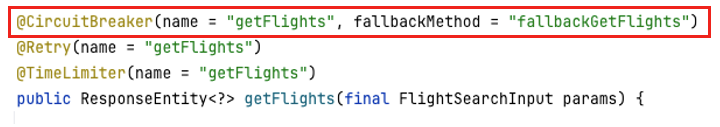
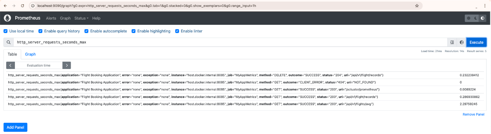
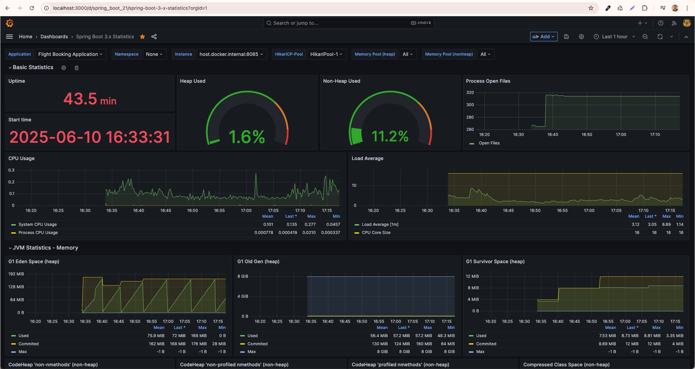

<h1 align="center">
  <br>
  
  <br>
</h1>

<p align="center">
  <strong>Flight Booking API</strong> — A fully functional Spring Boot application following Clean Architecture principles, showcasing resilience, observability, and modern microservices practices.
</p>

---

## 📚 Table of Contents

- [🔍 About the Project](#about-the-project)
  - [🔧 Tools & Plugins](#tools--plugins)
  - [📑 Documentation](#swagger-documentation)
  - [📊 Case Study](#case-study)
  - [🚀 How FlightBooking Works](#how-flightbooking-works)
  - [⚙️ Running the Project](#running-the-project)
  

- [🏛 Architecture](#architecture)
  - [🧱 Clean Architecture Principles](#clean-architecture-principles)
  - [🗂 Project Structure](#project-structure)
  - [📌 Key Terminologies](#key-terminologies)
  

- [🧠 Patterns & Practices](#patterns--practices)
  - [🗃 Caching](#caching)
  - [🛡 Circuit Breaker](#circuit-breaker)
  

- [📈 Observability](#observability)
  - [🔍 Actuator](#actuator)
  - [📡 Prometheus](#prometheus)
  - [📊 Grafana](#grafana)
  

- [🛠 Error Handling](#error-handling)


- [🧪 Testing](#testing)
  - [✅ Integrated Tests - Cucumber](#integrated-tests---cucumber)


- [ℹ️ Helpful Resources](#helpful-resources)
- [🔗 Useful Links](#useful-links)

---

## 🔍 About the Project

This is a Spring Boot application simulating a real-world flight booking system. It demonstrates the use of Clean Architecture, caching, resilience patterns, observability, API documentation, and integration testing.

---

### 🔧 Tools & Plugins

* Java JDK 23.0.1
* Spring Boot 3.3.5
* Maven 3.87
* Cucumber 7.13.0
* Junit 5
* Lombok 1.18.34
* Postgres 13
* Elastic Search 8.15.3
* Docker
* OpenApi 2.1.0
* Resilience4j 1.7.1
* Actuator 3.3.5
* Prometheus 2.44.0
* Graphana 9.5.2
* Slfj 1.7.36
* Developed with: IntelliJ IDEA 2025.1.2 (Community Edition)
---

### 📑 Documentation

- [Swagger](http://localhost:8085/swagger-ui/index.html)
- [Postman Collection](https://drive.google.com/drive/folders/187wQkcLSKkIvQKHo5Jywe4cmQayKR9Bf?usp=sharing)

---

### 📊 Case Study

Access the series of four articles published on Medium and see details about the implementation of this project:

- [Part I](https://medium.com/@souzaluis/applying-clean-architecture-in-java-with-spring-boot-framework-part-i-0847fb2833c2)
- [Part II](https://medium.com/@souzaluis/applying-clean-architecture-in-java-with-spring-boot-framework-part-ii-839489387308)
- [Part III](https://medium.com/@souzaluis/applying-clean-architecture-in-java-with-spring-boot-framework-part-iii-b1269635ed0c)
- [Part IV](https://medium.com/@souzaluis/applying-clean-architecture-in-java-with-spring-boot-framework-part-iv-a3cb82d5421a)

---

### 🚀 How FlightBooking Works

The system:
- Analyzes flights by destination, date, airline, and currency
- Calculates average flight prices and baggage costs
- Stores results in a historical database

**External APIs used:**
- Flights: https://run.mocky.io/v3/75ff38da-58e1-4f00-8135-008c31e4415b  
- Airport Locations: https://run.mocky.io/v3/efb63a70-f1c8-4c01-996b-de8c179f3b5c  

---

### ⚙️ Running the Project

```bash
# Step 1: Build the project
mvn clean install -DskipTests=true

# Step 2: Run the project with Docker
docker compose up --build
```

**Main endpoint example:**
```
GET /api/v1/flights/avg?flyTo=LIS,OPO&currency=GBP&dateFrom=2024-12-01&dateTo=2024-12-02&airLines=TP,FR&page=1&rpp=11
```

> Also includes endpoints for reading and deleting historical flight records.

---

## 🏛 Architecture

### 🧱 Clean Architecture Principles

This project follows Uncle Bob's Clean Architecture:
- **Entities** (core business logic)
- **Use Cases** (application rules)
- **Interface Adapters** (API/controller layer)
- **Frameworks/Drivers** (external services like DB, cache, etc.)

> 

---

### 🗂 Project Structure

> 

---

### 📌 Key Terminologies

- **DTO**: Lightweight objects used for data transfer  
- **Model**: Rich domain objects with validation and logic  
- **Mapper**: Convert between models and DTOs

---

## 🧠 Patterns & Practices

### 🗃 Caching

Implements `@Cacheable` to reduce DB load and improve performance.

> 

---

### 🛡 Circuit Breaker

Uses Resilience4j to prevent repeated failures when external services are down.

> 

---

## 📈 Observability

### 🔍 Actuator

Health Check Endpoint:  
[http://localhost:8085/actuator/health](http://localhost:8085/actuator/health)

```json
{
  "status": "UP",
  "components": {
    "db": { "status": "UP" },
    "diskSpace": { "status": "UP" },
    "elasticsearch": { "status": "UP" }
  }
}
```

---

### 📡 Prometheus

- Access Prometheus at: [http://localhost:9090](http://localhost:9090)  
> 

---

### 📊 Grafana

- Access Grafana at: [http://localhost:3000](http://localhost:3000)  
- Default user/password: `admin/admin`  
> 

---

## 🛠 Error Handling

Standardized error format ensures consistency across APIs:

```json
{
  "timestamp": "2023-01-15T10:37:14",
  "httpCode": 500,
  "message": "Internal Server Error",
  "detail": "The flight codes are invalid. Use airport codes like: OPO,LIS."
}
```

> 

---

## 🧪 Testing

- Integration testing with **Cucumber + JUnit 5**
- PostgreSQL container required before running tests

### ✅ Integrated Tests - Cucumber

> 

---

## ℹ️ Helpful Resources

- **Airlines API**: https://api.skypicker.com/airlines  
- **Airport Codes**: https://airportcodes.aero/iata/

| IATA-Code | Airline          | Country   |
|-----------|------------------|-----------|
| TP        | TAP Air Portugal | Portugal  |
| FR        | Ryanair          | Ireland   |

---

## 🔗 Useful Links

- [Clean Architecture by Uncle Bob](https://blog.cleancoder.com/uncle-bob/2012/08/13/the-clean-architecture.html)
- [Red Hat Clean Architecture Example](https://developers.redhat.com/articles/2023/08/08/implementing-clean-architecture-solutions-practical-example)