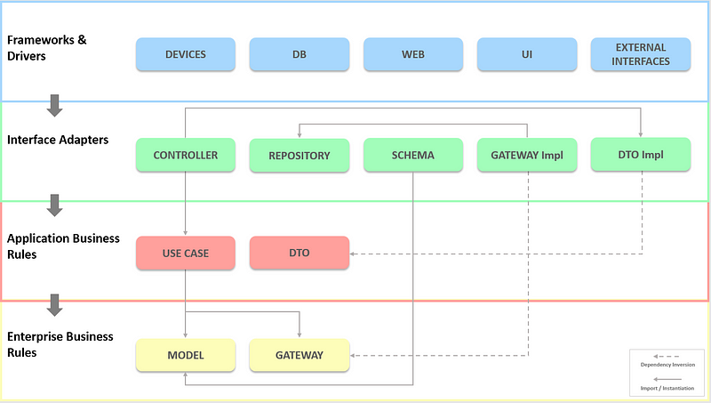
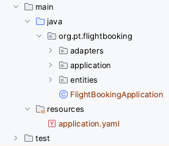
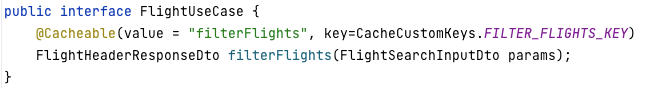
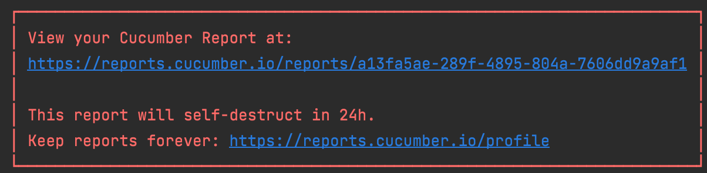
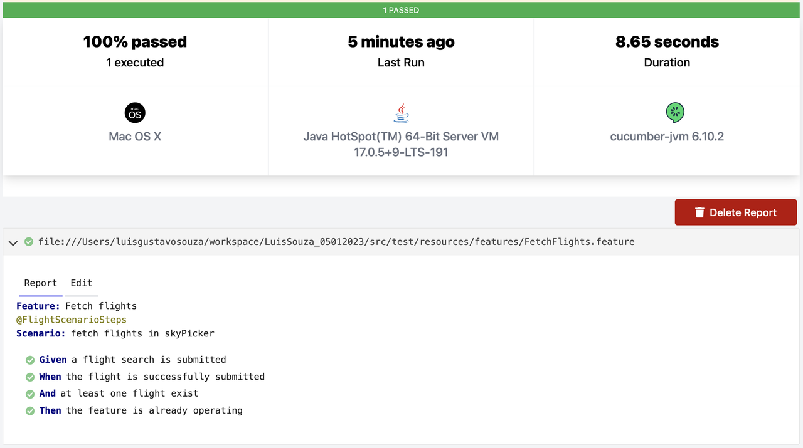

<h1 align="center">
  <br>
   
  <br>
</h1>

<p align="center">
  This repository contains an example of a rest project developed in Java with SpringBoot and with the integration of other tools. This project addresses good practices, the implementation of layered architecture, the adoption of good practices for exception handling, the adoption of solid principles, and others. the purpose of this project is to apply good practices, implement good structures, test new java updates and other tools.
</p>

***

## Tools and plugins used in this project

* Java JDK 20.0.1
* Spring Boot 3.3.5
* Maven 3.87
* Cucumber 7.13.0
* Junit 5
* Lombok 1.18.34
* Postgres 13
* Elastic Search 8.15.3
* Docker
* OpenApi 2.1.0
* Slfj 1.7.36
* Developed with: IntelliJ IDEA 2023.1.1 (Ultimate Edition)

*******

## Swagger Documentation

* Check the Swagger documentation on browser: http://localhost:8085/swagger-ui/index.html
* If you need, you can get a [Postman Collection] to help the execution of the tests.

*******

## Case study

* Access the series of four articles published on Medium and see details about the implementation of this project.


* **PART I** - https://medium.com/@souzaluis/applying-clean-architecture-in-java-with-spring-boot-framework-part-i-0847fb2833c2


* **PART II** - https://medium.com/@souzaluis/applying-clean-architecture-in-java-with-spring-boot-framework-part-ii-839489387308


* **PART III** - https://medium.com/@souzaluis/applying-clean-architecture-in-java-with-spring-boot-framework-part-iii-b1269635ed0c


* **PART IV** - https://medium.com/@souzaluis/applying-clean-architecture-in-java-with-spring-boot-framework-part-iv-a3cb82d5421a
*******

## How FlightBooking works?

* FlightBooking will analyze all searched flights by period, destination, currency and airports.
  After
  carrying out the search, the API will calculate the average price of all flights and the average
  price of baggages. All the flights data will be provided by apis:

- **Get Flights API:** https://run.mocky.io/v3/f1c93e7c-f38a-439e-8a2a-8a5341447084
- **Get Airport Locations API:** https://run.mocky.io/v3/3796db51-102d-4ea3-8433-c8a78c348c19

* Internally, the logic is executed after getting the flights. The first step is to group the
  flights by destination, after that go through all the flights and calculate the average price of
  all the flights, and finally go through all the baggage costs (baggage one and baggage two) and
  calculate the average price of each one.
  After executing all the logic, a record will be stored in the database history

*******

## Clean Architecture:

<p align="center">

</p>

## Clean Architecture Flight Booking Design

<p align="center">

</p>

### Entities:

* In this package, the objects represent the core business logic and rules of the application. It contains the most abstract and high-level elements, and should be completely independent of any external systems or frameworks like databases, user interfaces, or web services. The key principle of the entity layer is to encapsulate the most fundamental business logic and data in a way that is highly stable and reusable.

### Application:

* In Clean Architecture, the application layer is responsible for the business logic and application-specific rules. It acts as a bridge between the user adapter and the entity layer, coordinating operations and managing the flow of data.


* This layer typically contains use cases, which define the application's actions and handle user input, ensuring that the rules of the domain are applied correctly. It also communicates with the infrastructure layer for data access and external services, but it remains independent of any specific frameworks or UI technologies. This separation promotes maintainability and testability.


### Adapter:

* Interface adapters layer  in Clean Architecture act as a bridge between the application layer and the presentation layer. They are responsible for:


  - Converting data between different formats.
  - Handling user input.
  - Managing the user interface.

* Essentially, they ensure that the application can effectively communicate with the user and present information in a way that is understandable and usable.

### Project Structure:

<p align="center">

</p>

*******

## Few Important Terminologies

* There are a few terminologies and concepts you should familiarize yourself, before going to the
  next section.

### Dto

* DTO (Data Transfer Object): A DTO is primarily used to transfer data between different layers of an application or across network boundaries. Its purpose is to carry data without including any business logic or methods beyond simple getters and setters. DTOs are lightweight, containing only the data necessary for the transfer.

### Model

* The model represents core business entities and often includes business logic, validations, and relationships between different data entities. It’s designed to encapsulate and enforce business rules and is closely tied to the application’s data layer, often aligning with database schemas

### Mapper

* Mappers are used to converting the form of data when transferred between layers. There are two
  types of Mappers:
* Model Mapper: This will map any data to the Model.
* DTO Mapper: This will map any data to DTOs.

*******


*******

## Error Handling

### The Importance of Api Exception Handling

* It is important to control exception handling so we can properly map exceptions to the ApiError
  object and inform API clients appropriately. Additionally, we would need to create more handler
  methods (the ones with @ExceptionHandler) for thrown exceptions within the application code.

<p align="center">


### The Importance of Api Exception Handling

* It is important to control exception handling so we can properly map exceptions to the ApiError
  object and inform API clients appropriately. Additionally, we would need to create more handler
  methods (the ones with @ExceptionHandler) for thrown exceptions within the application code.


### Exception response example:

```sh
      {
        "timestamp": "2023-01-15T10:37:14.301677",
        "httpCode": 500,
        "message": "Internal Server Error",
        "detail": "The flight codes is invalid. Please insert two airport codes separated by commas, example: (OPO,LIS) or (LIS,OPO) to fetch data from PORTO and LISBON flights. Consult the link: https://airportcodes.aero/iata/ and see if the codes are valid.."
      }
```

*******

## Caching

* This application uses Spring's native caching system, through spring-boot-starter-cache, the use of the annotation @Cacheable can be seen in the method below:



*******

## Running this project

1. Generate the project .jar file running the command:

    ```sh
      mvn clean install -DskipTests=true
    ```

2. Enter in the root of the project and run the project image with the command above:

   ```sh
     docker compose up --build
    ```

3. Consume the api: /api/v1/flights/avg, informing the parameters below:

   Example: http://localhost:8085/api/v1/flights/avg?flyTo=LIS,OPO&currencyÍ=GBP&dateFrom=2024-12-01&dateTo=2024-12-02&airLines=TP,FR&page=1&rpp=11
   #### Parameters:
   ```sh
      flyTo = Inform the desired destination of the flight, it is possible to enter only one destination or more than one separated by a comma, 
      Example: OPO (only Porto), LIS (only Lisbon), OPO,LIS (Porto and Lisbon)
      
      currency = The currency which the cost of the flight will be calculated.
      Example: EUR (Euro), GBP (British Pounds Sterling)
   
      airLines = Airlines to be filtered
      Example: TP (TAP), FR (Ryanair)
      
      dateFrom = Flight departure date
      Example: 2024-12-01
   
      dateTo = Flight arrival date
      Example: 2024-12-02
   
      
    ```

   The api will generate a average response like this:
   ```sh
       {
               "meta": {
                   "page": 1,
                   "recordsPerPage": 11,
                   "totalPages": 1,
                   "version": "0.0.1",
                   "duration": 15897
               },
               "data": {
                   "averageFlights": {
                       "LIS": {
                           "cityName": "Lisbon",
                           "currency": "GBP",
                           "priceAverage": 32.0,
                           "bagsPrice": {
                               "bagOneAveragePrice": 50.29,
                               "bagTwoAveragePrice": 143.08
                           }
                       },
                       "OPO": {
                           "cityName": "Porto",
                           "currency": "GBP",
                           "priceAverage": 51.54,
                           "bagsPrice": {
                               "bagOneAveragePrice": 52.48,
                               "bagTwoAveragePrice": 138.11
                           }
                       }
                   },
                   "dateFrom": "01/12/2024",
                   "dateTo": "02/12/2024"
               }
        }      
     ```

4. Consume the api: /api/v1/flight/records to show all flight records in history
   Example: GET http://localhost:8085/api/v1/flight/records?page=1&rpp=1


5. Consume the api: /api/v1/flight/records to delete all flight records in history
   Example: DELETE http://localhost:8085/api/v1/flight/records

6. Consume the api: /api/v1/flight/records to delete flight records in history by id
   Example: DELETE http://localhost:8085/api/v1/flight/records/ID_HERE

*******

## Information that can help you

- **Airlines API:** https://api.skypicker.com/airlines
- **Airport code:** https://airportcodes.aero/iata/

| IATA-Code | ICAO-Code | Prefix-Code | Airline          | Country  
|-----------|-----------|-------------|------------------|----------|
| TP        | TAP       | 047         | TAP Air Portugal | Portugal |
| FR        | RYR       | --          | Ryanair          | Ireland  |

*******

## Test results

* The tests have not yet been configured to work without the launch context, so to run the unit and
  automated tests, start the postgres container first and then run the tests.

### Integrated tests - Cucumber

* the result of the automated tests can be accessed visually through the link generated after
  running the tests, similar to the example below:

<p align="center">

</p>

* the results will have a display as the image below:

<p align="center">

</p>

[Postman Collection]: https://drive.google.com/drive/folders/187wQkcLSKkIvQKHo5Jywe4cmQayKR9Bf?usp=sharing

### Useful Links 

* https://developers.redhat.com/articles/2023/08/08/implementing-clean-architecture-solutions-practical-example


* https://blog.cleancoder.com/uncle-bob/2012/08/13/the-clean-architecture.html
